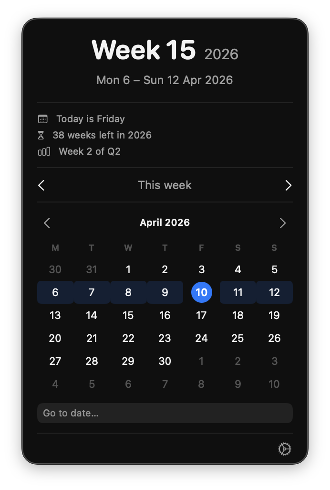

# Week Number

A native Apple app suite that shows the current ISO week number across all your devices — macOS menu bar, iPhone, Apple Watch, and a home screen widget.

## Platforms

| Platform | Target |
|----------|--------|
| macOS | Menu bar app |
| iOS | Full-screen app |
| watchOS | Watch app with Digital Crown navigation |
| iOS Widget | Small and medium home screen widgets |

## Features

- **ISO 8601 week numbers** — correct week boundaries using `minimumDaysInFirstWeek = 4`
- **Week stats** — day of week, weeks remaining in year, quarter info (e.g. "Week 2 of Q2")
- **Week navigation** — browse forward and back by week, jump back to today
- **Mini calendar** — visual week grid for the current month
- **Configurable week start** — Monday or Sunday
- **Menu bar format** (macOS) — choose between `W14`, `14`, or `Wk 14`
- **Launch at login** (macOS)
- **Digital Crown scrolling** (watchOS) — scroll between weeks with haptic feedback
- **Adaptive widget** — small widget shows week + date range; medium adds weeks remaining

## Screenshots

> Screenshots coming soon. See the [Adding Screenshots](#adding-screenshots) section below.

## Requirements

- Xcode 16+
- macOS 15+ (for the macOS target)
- iOS 18+ (for the iOS and widget targets)
- watchOS 11+ (for the watch target)

## Getting Started

1. Clone the repo
2. Open `week-number.xcodeproj` in Xcode
3. Select the target you want to run (`mac`, `ios`, or `watch`)
4. Build and run

## Project Structure

```
shared/
  Date+Week.swift       # ISO 8601 week calculations shared across all targets
mac/
  week_numberApp.swift  # MenuBarExtra entry point
  WeekStore.swift       # Observable state + settings persistence
  PopoverView.swift     # Main popover layout
  CurrentWeekView.swift # Large week number card
  WeekNavView.swift     # Prev/next week navigation controls
  MiniCalendarView.swift
  SettingsView.swift
ios/
  iOSApp.swift
  ContentView.swift     # Mirrors the macOS popover layout as a scroll view
  iOSWeekStore.swift
  WeekNavView.swift
  MiniCalendarView.swift
  SettingsView.swift
watch/
  WatchApp.swift
  WatchContentView.swift
  WatchWeekStore.swift
widget/
  WeekWidget.swift      # WidgetKit provider, small + medium layouts
```

## Screenshots

3. **Reference them in this README** using relative paths:
   ```markdown
   
   
   ```

4. **Commit the images** along with the updated README:
   ```bash
   git add docs/screenshots/ README.md
   git commit -m "Add screenshots"
   ```

> Tip: keep screenshots at 2x resolution (retina) but export at a reasonable size (e.g. 600–800px wide) so the README doesn't feel heavy.
